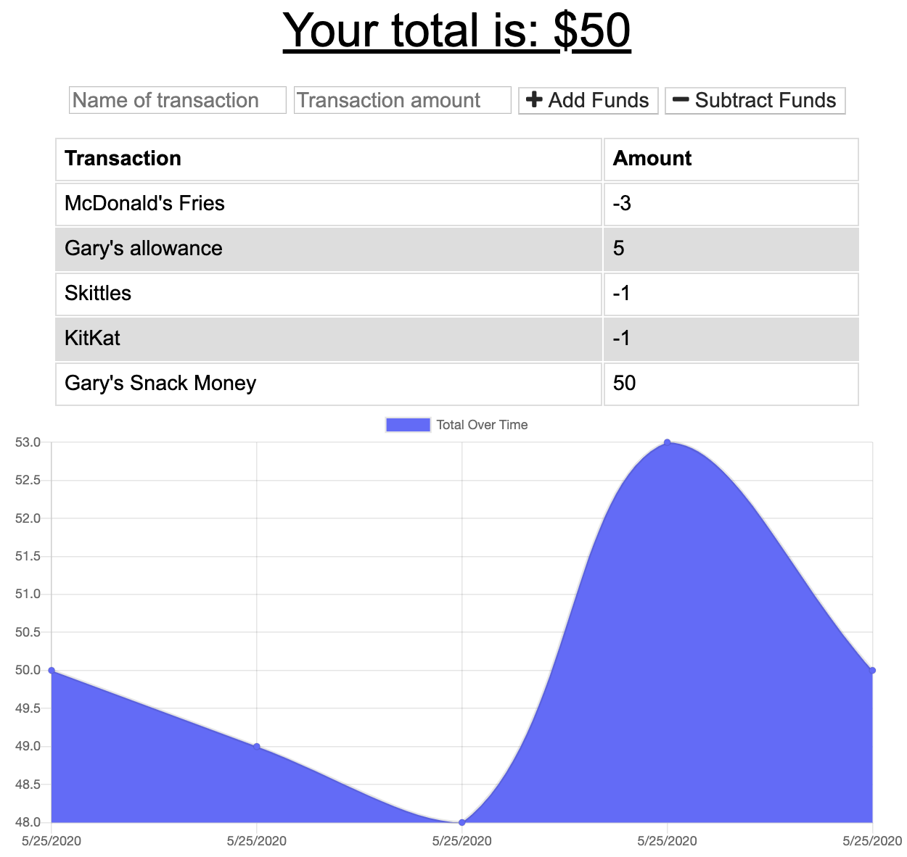

## github.com/dylanhulbert/homework-14
I created the contents of this repo as homework for my Bootcamp at UofO

## Homework 14: Budget Tracker
The objective of this homework was to create a [PWA](https://en.wikipedia.org/wiki/Progressive_web_application) that allows for offline access and functionality.

Similar to [Homework 13](https://github.com/dylanhulbert/homework-13), the application uses automatic deployments on commit via [Heroku](https://www.heroku.com/) and a sandbox MongoDB db resource on [MLab](https://www.mlab.com/).

11/28/20 - Updated MongoDB location, from mLab to [Atlas](https://www.mongodb.com/cloud/atlas).

## Technologies
* [Web App Manifest](https://developer.mozilla.org/en-US/docs/Web/Manifest)
* [Sevice Worker](https://developer.mozilla.org/en-US/docs/Web/API/Service_Worker_API)
* [Node.js](https://nodejs.org/en/)
* [Express](https://expressjs.com/)
* [Mongoose](https://mongoosejs.com/) for [MongoDB](https://www.mongodb.com/)

## Application
You can view the functioning application [running on Heroku](https://hulbert-homework-14.herokuapp.com/).

